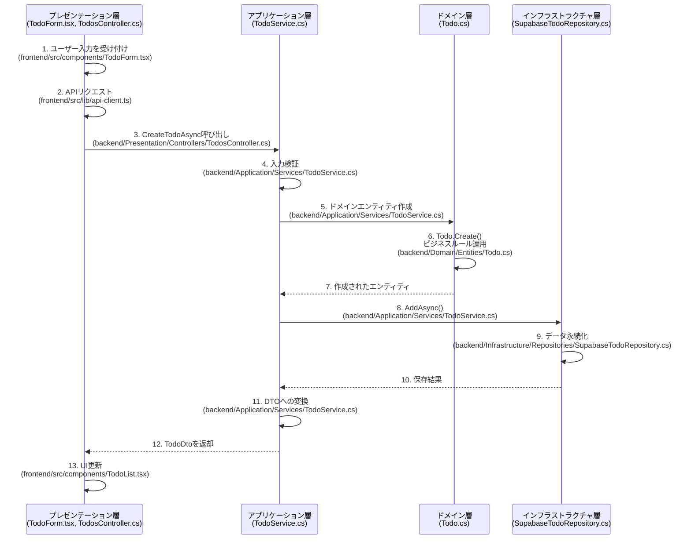
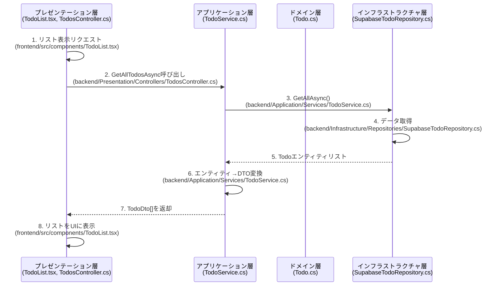
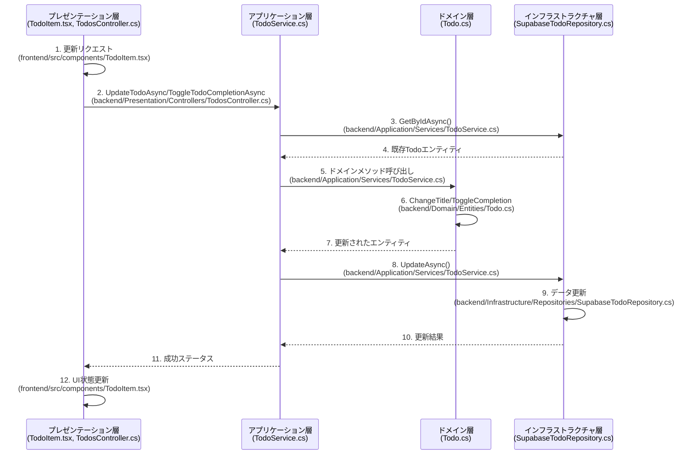
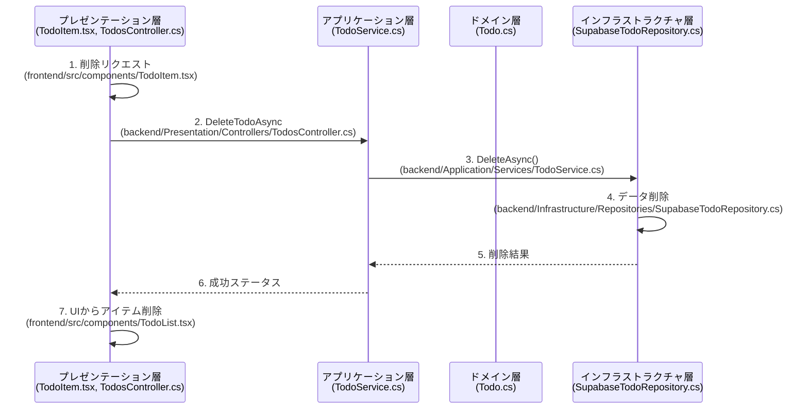

## 背景

C# でドメイン駆動設計(DDD) の勉強を始めました。

[ドメイン駆動設計入門 ボトムアップでわかる! ドメイン駆動設計の基本](https://www.amazon.co.jp/%E3%83%89%E3%83%A1%E3%82%A4%E3%83%B3%E9%A7%86%E5%8B%95%E8%A8%AD%E8%A8%88%E5%85%A5%E9%96%80-%E3%83%9C%E3%83%88%E3%83%A0%E3%82%A2%E3%83%83%E3%83%97%E3%81%A7%E3%82%8F%E3%81%8B%E3%82%8B-%E3%83%89%E3%83%A1%E3%82%A4%E3%83%B3%E9%A7%86%E5%8B%95%E8%A8%AD%E8%A8%88%E3%81%AE%E5%9F%BA%E6%9C%AC-%E6%88%90%E7%80%AC-%E5%85%81%E5%AE%A3/dp/479815072X)を半分程度読んだ程度ですが、実際のコードベースでも、内容を振り返り`理解を深めたい`と思うようになりました。

そこで、Cursor の Agent 機能を活用して DDD の観点で Todo アプリを作成しました。
このアプリを「学習教材」として、「どのファイルがどの DDD 概念を表現しているのか」「データはどのように各層を通過するのか」といった具体的な質問を AI に投げかけながら、DDD の理解を深めていきました。

本記事では、実際に作成した Todo アプリの作成過程(プロンプト)、[作成したアプリのソースコード](https://github.com/naoki0803/csharp-todo-app)、DDD に関する質問・回答を共有します。
DDD を学んでいる方、特に「実際のコードベースでどう表現されるかを見てみたい」と思っている方の参考になれば幸いです。

::: message
現在も学習途中のため、本を読み進めながら新たな疑問点を作成したアプリを元に質問し、その内容を適宜追記していく予定です。DDD の理解の旅にぜひお付き合いください。
:::

## 作成した TODO アプリ


詳細は、以下 GitHub リポジトリの README を参照してください。
https://github.com/naoki0803/csharp-todo-app

### 作成時のプロンプト

Cursor の Agent 機能を活用して、以下プロンプトを投げています。

:::details プロンプト

```md
# 実施してほしいこと

ドメイン駆動設計(DDD)の観点で、todo アプリを作成してください。

# 目的と背景

-   DDD の勉強を始めたのですが実際に DDD の観点で Web アプリを作成し、出来上がったものを確認して理解を深めたいと考えています。
-   私は csharp や ts 初学者で、基本構文などを勉強してきました。(spabase は未経験)
-   作成したソースコードには適宜コメントを入れていただき、初学者が見たときにわかりやすいようにしてください。

# 技術スタック

-   フロント: react, TS
-   バックエンド: csharp(.net9)
-   DB: Spabase
-   デプロイ: Vercel

## フロントエンドについて

-   利用するコンポーネントライブラリは shadocn
-   eslint を採用してください

## バックエンドについて

-   ドメイン駆動設計を採用してください

## DB

-   作成するにあたって、必要な情報があれば提示するのでコメントしてください。

# 作成 Directory

現在、~/project/csharp-todo-app という Directory がワークフォルダになっています。ここにプロジェクトを作成してください。
```

:::
::: message
プロンプトを投げて`はい完成`とはならず、DB 作成や、バグ修正を AI に確認しながら作成を進めました。
現状ではまだ多くのバグが残っており、CRUD の CR だけ動く状態です。
:::

## DDD に関する質問と回答

現状では、以下のような質問を実施しています。
実際には回答を Todo アプリの README.md に追加して後から確認できるようにしています。
※回答は長いので、アコーディオンで折りたたんでいます。

### DDD の観点で、どのようにアプリが実装されていますか？

::: details 回答

## ドメイン駆動設計（DDD）の実装

このアプリケーションは、ドメイン駆動設計（DDD）の原則に基づいて構築されています。以下に各レイヤーの責任と実装の詳細を示します：

### プロジェクトディレクトリと DDD レイヤーの対応

```

backend/
├── Domain/ - ドメイン層
│ ├── Entities/ - エンティティクラス (Todo.cs)
│ └── Repositories/ - リポジトリインターフェース (ITodoRepository.cs)
├── Application/ - アプリケーション層
│ ├── DTOs/ - データ転送オブジェクト (TodoDto.cs など)
│ └── Services/ - アプリケーションサービス (TodoService.cs)
├── Infrastructure/ - インフラストラクチャ層
│ └── Repositories/ - リポジトリ実装 (SupabaseTodoRepository.cs)
└── Presentation/ - プレゼンテーション層
└── Controllers/ - API コントローラー (TodosController.cs)

```

フロントエンドは主にプレゼンテーション層の役割を担い、以下のディレクトリ構成になっています：

```

frontend/src/
├── components/ - プレゼンテーション層 (React コンポーネント)
│ ├── TodoForm.tsx - Todo 作成フォーム
│ ├── TodoList.tsx - Todo リスト表示
│ └── TodoItem.tsx - 個別 Todo アイテム
└── lib/
└── api-client.ts - バックエンド API とのインターフェース

```

### レイヤー間の依存関係

-   ドメイン層は他のどのレイヤーにも依存しない（内側レイヤー）
-   アプリケーション層はドメイン層に依存する
-   プレゼンテーション層はアプリケーション層とドメイン層に依存する
-   インフラストラクチャ層はアプリケーション層とドメイン層に依存する（依存性逆転の原則）

### ドメイン層

**役割**:

-   ビジネスロジックの中核
-   エンティティとその振る舞い
-   不変条件の実装
-   値オブジェクト

**対応ディレクトリ**: `backend/Domain/`
**主要ファイル**:

-   `Todo.cs` (エンティティ)
-   `ITodoRepository.cs` (リポジトリインターフェース)

**実装詳細**:

1. **Todo エンティティ**:

    - ID、タイトル、完了フラグ、作成日時、ユーザー ID の属性を持つ
    - プライベートセッターでカプセル化を実現し、不変性を保証
    - ファクトリメソッド `Create()` で新しい Todo を作成
    - タイトル変更、完了/未完了の設定、完了トグルなどのドメインロジックを実装

2. **ITodoRepository インターフェース**:
    - データアクセスの抽象化を提供（永続化の詳細からドメインを分離）
    - `GetAllAsync()`: すべての Todo を取得
    - `GetByIdAsync()`: 特定 ID の Todo を取得
    - `AddAsync()`: 新しい Todo を追加
    - `UpdateAsync()`: 既存 Todo を更新
    - `DeleteAsync()`: Todo を削除

### アプリケーション層

**役割**:

-   ユースケースのオーケストレーション
-   入力検証とビジネスルールの適用
-   トランザクション管理
-   ドメインオブジェクトと DTO の変換

**対応ディレクトリ**: `backend/Application/`
**主要ファイル**:

-   `TodoService.cs` (サービス)
-   `TodoDto.cs`, `CreateTodoDto.cs`, `UpdateTodoDto.cs` (DTO クラス)

**実装詳細**:

1. **DTO オブジェクト**:

    - `TodoDto`: 表示用の完全な Todo 情報
    - `CreateTodoDto`: 新規作成時に必要な情報
    - `UpdateTodoDto`: 更新時に使用する情報（部分更新可能）

2. **TodoService**:
    - リポジトリを注入し、アプリケーションロジックを実装
    - ドメインエンティティと DTO の相互変換
    - 入力検証とビジネスルールの適用
    - 各操作の実装：
        - `GetAllTodosAsync()`: すべての Todo を DTO に変換して返却
        - `GetTodoByIdAsync()`: ID 指定で Todo を検索、存在確認
        - `CreateTodoAsync()`: 入力検証後、Todo エンティティを作成
        - `UpdateTodoAsync()`: ID 検証と部分更新の実施
        - `DeleteTodoAsync()`: ID での削除と存在確認
        - `ToggleTodoCompletionAsync()`: Todo の完了状態を切り替え

### プレゼンテーション層

**役割**:

-   ユーザーインターフェースとの対話
-   API リクエスト/レスポンスの処理
-   データの表示フォーマット
    **対応ディレクトリ**:

-   `backend/Presentation/` (バックエンド)
-   `frontend/src/components/` (フロントエンド)

**主要ファイル**:

-   `TodosController.cs`
-   `TodoForm.tsx`, `TodoList.tsx`, `TodoItem.tsx`

### インフラストラクチャ層

**役割**:

-   データアクセス
-   外部サービス連携
-   永続化
-   キャッシュなどの技術的関心事

**対応ディレクトリ**: `backend/Infrastructure/`
**主要ファイル**: `SupabaseTodoRepository.cs` (リポジトリ実装)

:::

### CRUD の処理別に、DDD の観点でデータフロー図を作成してください

::: details 回答

## DDD アーキテクチャに基づく CRUD 操作のデータフロー図

各 CRUD 操作におけるデータの流れを、DDD の各レイヤーを中心とした視点でのデータフロー図を以下に示します。これにより、DDD アーキテクチャでのデータのライフサイクルと各レイヤーの責任範囲が明確になります。

### 新規 Todo の作成（Create）- DDD 視点



### Todo リストの取得（Read）- DDD 視点



### Todo の更新（Update）- DDD 視点



### Todo の削除（Delete）- DDD 視点



:::

### 質問は今後も追加予定･･･

::: details 回答
:::

## まとめ

[ドメイン駆動設計入門 ボトムアップでわかる! ドメイン駆動設計の基本](https://www.amazon.co.jp/%E3%83%89%E3%83%A1%E3%82%A4%E3%83%B3%E9%A7%86%E5%8B%95%E8%A8%AD%E8%A8%88%E5%85%A5%E9%96%80-%E3%83%9C%E3%83%88%E3%83%A0%E3%82%A2%E3%83%83%E3%83%97%E3%81%A7%E3%82%8F%E3%81%8B%E3%82%8B-%E3%83%89%E3%83%A1%E3%82%A4%E3%83%B3%E9%A7%86%E5%8B%95%E8%A8%AD%E8%A8%88%E3%81%AE%E5%9F%BA%E6%9C%AC-%E6%88%90%E7%80%AC-%E5%85%81%E5%AE%A3/dp/479815072X)を読んで、なんとなく理解した部分を、実際にコードベースで確認する事で解像度を上げることができました。
引き続き、本を読み進めていく中で、DDD の理解を更に深めていこうと思います。

また、学習スタイルとして、何かベースとなる書籍などで学びつつ、AI を活用してアプリを作成して全体をつかみ、掘り下げた質問を AI に投げることで、理解を深めていく今回の方法は学びが多いと感じました。(まだ検証中ではありますが。。。)
